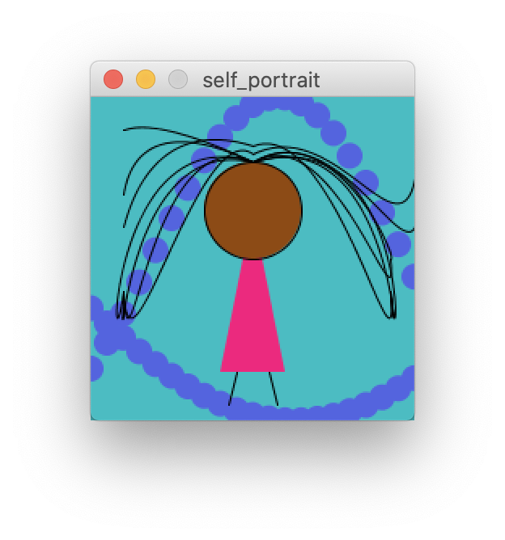

# Art using loops and functions

I chose to use my self portrait for this assignment because I ended up using loops to convey the water in the background for me. 

I used a for loop to draw each moving pixel for the sin wave. There are two sin waves, they are different shapes by changing the angle variable, which I call the mathematical sin function on to create the next point in the wave. Essentially, I have a variable "angle" which I will call sin on, then I use map adjusts my range to a new one using the "angle" variable, and therefore converts it to the upper and lower bounds of the current window (https://processing.org/reference/map_.html). The lower bound and upper bound of the current value's range which I set to be between -1 and 1 so it inches the dot slowly like a wave, and then the next target range's lower bound is 0 and the upper bound is the "height" variable, which is a system variable (https://processing.org/reference/height.html). 

My inspiation was trying to make waves. If I had more time, I would be really interested in trying to change my hair into one moving object, like it is floating in water. So that's what I'm going to try and iterate off of it next. 

The main difficulty I had was trying to understand / remember what a sin wave is and how I can take advantage of a commonly known algorithm to convert into water I wanted to convey. Thankfully there were some examples which walked me through the process online (https://processing.org/examples/sinewave.html), and I was able to derive how to add it to my program from there. 
