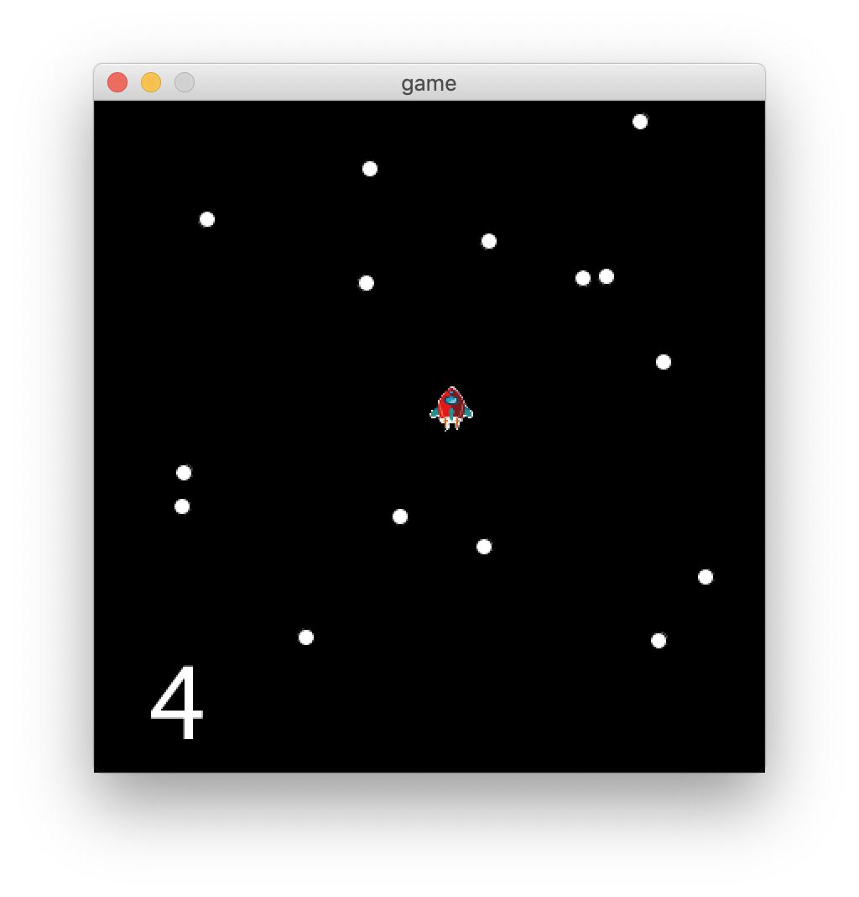

# Space Game!

I made a space race game! 

My inspiration for this game is all of the original space race and astroid blaster games. I made a small simplified version, and would like to add blasting the astroids too later! 

In this game, you gain points by getting your spaceship to cross to the top of the screen without crashing into any astroids. Every two points that you get, the speed increases by 20%. When you lose points by hitting the astroids, the speed also decreases by 20% to help you out. 

The difficulties I had creating this game were mostly fixing bugs with the interaction of classes. The speed is defined in the astroids class, but the score is in the spaceship class. I created some interactions between them, which at first had some funny bugs like one astroid going very, very fast while the others were slow or all the astroids instantly went super fast. 

My next steps for this will be to increase the amount of astroids that show up and to have a second player so you can compete with a friend locally. I would have the second player use w and s keys for forward and backards. I also might include the ability to move left and right. 

